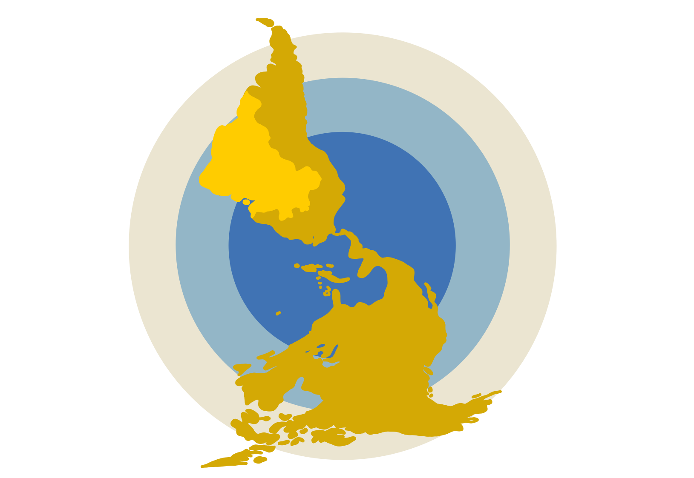

# Brazil, the Americas and the World

Here you find data from the research project Brazil, the Americas and the World, a branch of the international collaborative program _Las Americas y el Mundo_ (The Americas and the World) based on the _Centro de Investigaciones en Desarrollo Económico -- CIDE_ ( Center for Economic Development Research) at Mexico DF. 
Las Americas and the World is the only encompassing study of elites’ and mass public’s opinions about international issues in Latin America.
Brazil, the Americas, and the World is funded by The São Paulo Research Foundation (FAPESP) and hosted by the Brazilian Center of Analysis and Planning (Cebrap).

# Research Team

<ul>

<li> <a href="http://lattes.cnpq.br/4797882536342819" target="_blank" rel="external"> Maria Hermínia Tavares de Almeida </a>, coordinator (Cebrap) 
 
</li>
 
<li> <a href="https://sites.google.com/site/ivanfilipefernandes/" target="_blank" rel="external"> Ivan Filipe Fernandes </a> (Federal University of ABC- UFABC)
 
</li>
 
<li> <a href="http://lattes.cnpq.br/7107955008495284" target="_blank" rel="external"> Feliciano de Sá Guimarães </a> (University of São Paulo - USP)
 
</li>
 
<li> <a href="http://lattes.cnpq.br/1920255833804512" target="_blank" rel="external"> Flávio Leão Pinheiro </a> (Federal University of ABC- UFABC)
 
</li>
 
<li> <a href="http://lattes.cnpq.br/6121326952317794" target="_blank" rel="external"> Leandro Piquet Carneiro </a> (University of São Paulo - USP)
 
</li>
 
<li> <a href="http://lattes.cnpq.br/3708102324198107" target="_blank" rel="external"> Janina Onuki </a>, associate researcher (University of São Paulo - USP)
 
</li>

</ul>
 

## Research Assistants

<li> Priscila Petris </li>
<li> Paloma Morais </li>
<li> Fernando Favalle </li>
<li> Cicley Dias </li>
<li> Giovanna França </li>
<li> Ingrid Meirelles </li>
<li> Juliana Santos </li>
<li> Caique Terenzzo </li>
<li> Beatriz Almeida da Silva </li>
<li> Gabriel Santos Carneiro </li>
 

## Research Associates

<li> Anna Carolina Mello </li>
<li> Bruno Castro </li>
<li> Luis Fernando Baracho </li>
<li> Enrique Natalino </li>
<li> Allegra Levandoski </li>
<li> <a href="https://catarinaroman.github.io/" target="_blank" rel="external"> Catarina Roman </a> </li>
 
 

# The Project 

 Brazil, the Americas, and the World aims at studying the perceptions of the mass public and the elites regarding international affairs and foreign policy issues. It comprises three related subprojects:

1. A panel survey with the mass public and social and political elites was conducted every four years (2010, 2015, 2019);
2. The Foreign Policy at Press Observatory follows the debate on Brazilian foreign policy in major press outlets through collecting and cataloging editorials and op-ed columns;
3. A survey experiment on how mass public preferences for foreign policies influence the opinions of the elites on these issues.

All the data collected in the survey waves conducted by the international teams of the _Las Americas y el Mundo_ in Mexico, Peru, Chile, Colombia, and Argentina and data collected for the _Foreign Policy at Press Observatory_ are available online on this page. You may find the issues of _Observatory of Brazilian Foreign Policy in the Press_ at [CEBRAP's webpage](http://cebrap.org.br/projetos/observatorio/).

# The Reports

The project team produces reports -- in Portuguese -- for each wave of the surveys. Below is the report with the 2018-19 results.

<iframe src="https://drive.google.com/file/d/1Vq275i3ek9Kc-Ds9tcj36EuMRc_X4gPp/preview" width="640" height="480" allow="autoplay"></iframe>

Next is the report for the 2014 wave.

<iframe src="https://drive.google.com/file/d/1XU-iezaawkZ__0-5wtsOxFdNo9_t0k2U/preview" width="600" height="480" allow="autoplay"></iframe>

If your browser does not support pdfs, you can download the 2014 report [here](https://github.com/las-americas/cebrap/blob/gh-pages/reports/relatorio-2014.pdf).

We also present the report for the 2010 survey wave.

<iframe src="https://drive.google.com/file/d/17JvmmcezDLfwXlA50dZ7_Wg2zkNofvfU/preview" width="600" height="480" allow="autoplay"></iframe>

If your browser does not support pdfs, you can download the 2010 report [here](https://github.com/las-americas/cebrap/blob/gh-pages/reports/relatorio-2010.pdf)

# Databases and Codebooks

## 2019

The dataset for the 2019 Brazilian wave of the survey can be downloaded [here](https://github.com/las-americas/cebrap/blob/gh-pages/2019-files/2019-database.csv)

The corresponding codebook follows below:
<iframe src="https://drive.google.com/file/d/1hLDwlvfEoPG6_gxILRgOZKBv7rng_azw/preview" width="600" height="480"></iframe>

If your browser does not support pdfs, you can download the 2019 codebook [here](https://github.com/las-americas/cebrap/blob/gh-pages/2019-files/codebook-2019-brazil.pdf).

The 2019 survey instrument (questionnaire) is available in [this link](https://github.com/las-americas/cebrap/blob/gh-pages/surveys/brazil-2019-survey.pdf).

## 2018

The dataset for the 2018 Brazilian leadership wave of the survey can be downloaded [here](https://github.com/las-americas/cebrap/blob/main/2018-files/leaders-2018-data.xlsx)

The corresponding codebook follows below:

If your browser does not support pdfs, you can download the 2018 codebook [here]().

The 2018 survey instrument (questionnaire) is available in [this link]().

## 2016

The dataset for the 2016 Brazilian leadership wave of the survey can be downloaded [here](https://github.com/las-americas/cebrap/blob/main/2016-files/2016-leader-data.xlsx)

The corresponding codebook follows below:

If your browser does not support pdfs, you can download the 2016 codebook [here]().

The 2016 survey instrument (questionnaire) is available in [this link](https://github.com/las-americas/cebrap/blob/main/surveys/2016-leader-questionnaire.pdf).

## 2014

The dataset for the 2014 Brazilian wave of the survey can be downloaded [here](https://github.com/las-americas/cebrap/blob/gh-pages/2014-files/2014-public-opinion-data.csv).

The corresponding codebook follows below:

If your browser does not support pdfs, you can download the 2014 codebook [here]().

The 2014 survey instrument (questionnaire) is available in [this link](https://github.com/las-americas/cebrap/blob/gh-pages/surveys/brazil-2014-survey.pdf).

## 2011

The dataset for the 2011 leadership survey can be dowloaded [here](https://github.com/las-americas/cebrap/blob/gh-pages/2011-files/2011-leader-data.dta)
The corresponding codebook follows below:

If your browser does not support pdfs, you can download the 2011 codebook [here]().

The 2010 survey instrument (questionnaire) is available in [this link](https://github.com/las-americas/cebrap/blob/gh-pages/surveys/brazil-2010-survey.pdf).

## 2010

The dataset for the 2010 Brazilian wave of the survey can be downloaded [here]().

The corresponding codebook follows below:

If your browser does not support pdfs, you can download the 2010 codebook [here]().

The 2010 survey instrument (questionnaire) is available in [this link](https://github.com/las-americas/cebrap/blob/gh-pages/surveys/brazil-2010-survey.pdf).

# Observatory of Brazilian Foreign Policy in the Press

<li> <B>What is the <i>Foreign Policy at Press Observatory</i>?</b>
 
 For decades, Brazilian foreign policy was not part of the public debate agenda. In fact, as it is formulated and undertaken by the Ministry of Foreign Affairs, with higher or lower intake from the Presidency, it has been typically produced under bureaucratic isolation due to social-political leaderships' and the public opinion's indifference, as well as political segments' exclusive focus on domestic politics. This situation has been changing for the past two decades. Although the Ministry of Foreign Affairs still concentrates control over Brazilian foreign policy, it can no longer be considered the result of decisions made by few behind closed doors. Thus, foreign policy becomes crescently dependent not only on the discipline and capacity of a trained bureaucratic elite, but also on consensus between what political scientist Amaury de Souza calles the "foreign policy community", and its capacity to produce framings of the Brazilian foreign policy that are shared by the public. 
 
 As the foreign policy audience broadened, opinions became diversified and often divergent. Nowadays, written press is concurrently the arena and the protagonist of an informed debate about the country's foreign policy. Hence, we decided to follow what is thought and what is said about the main actors of the written press. The protagonists being translated through their editorials. Their medium, translated through their signed articles expressing opinions of permanent and invited collaborators. Our team of investigators reads, catalogues, and organizes thematically the signed articles and published editorials in the highest circulating printed press. We follow, simultaneously, the official statements of first-scale authorities -- President, Vice-President, Minister of Foreign Affairs -- about Brazilian Foreign Policy. The most important information is published on the [Observatory webpage](http://cebrap.org.br/projetos/observatorio/), every semester.
</li>

<li> <b>Methodology</b>
 
 Our team of investigators reads, catalogues, and organizes thematically the signed articles and published editorials in the highest circulating daily or weekly printed press: Folha de S. Paulo, O Globo, O Estado de S. Paulo and Valor Econômico. Recently, we added the exclusively digital news outlet Gazeta do Povo. Aside from reporting the position expressed in each publication about Brazilian foreign policy, we follow a series of themes specifically related to the orientations and major contributions of government in the international arena. We classify as contrary to the foreign policy those articles that criticize it explicitly, and as aligned to foreign policy are those that explicitly approve of it. The CEBRAP thermometer, which aims to measure the degree of support to Brazilian foreign policy, takes into consideration onl articles, interviews, and editorials that are explicitly in favor of the administration's international activity.
 </li>

